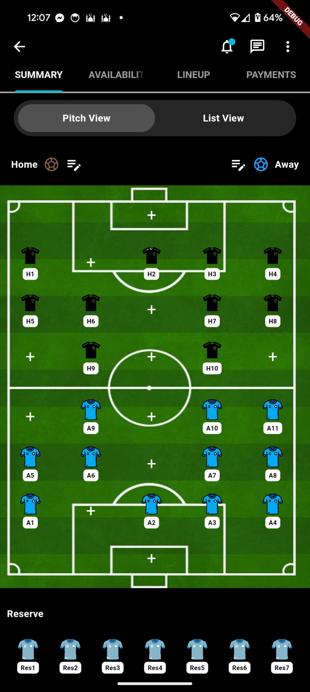
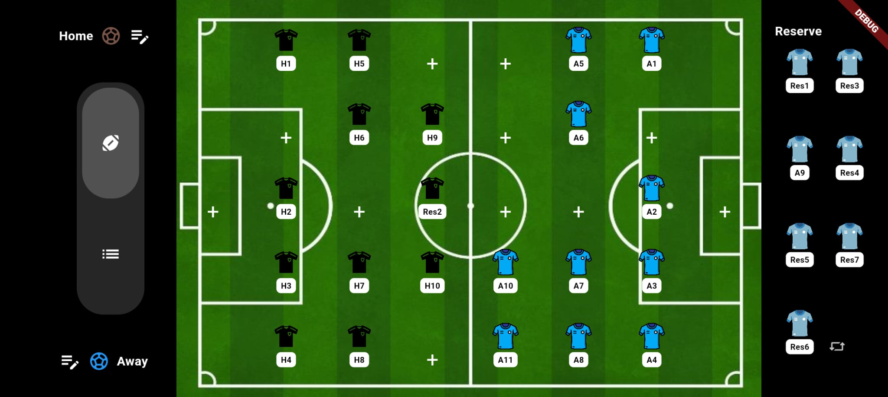

# Football App

This is a Flutter project for a football lineup and management app. The app provides functionality to display and manage teams and players on a football pitch, optimized for both portrait and landscape orientations.

## Screenshots

Here are some screenshots of the app:




## Getting Started

These instructions will help you set up and run the project on your local machine for Android development.

### Prerequisites

- **Flutter**: Make sure you have Flutter installed. You can download it from [flutter.dev](https://flutter.dev/docs/get-started/install).
- **Android Studio** or **Visual Studio Code** with Flutter and Dart plugins.
- **Android Emulator** or a physical Android device for testing.

### Running the App on Android

**Clone the Repository**:
   ```bash
   git clone https://github.com/your-username/football.git
   cd football
   flutter pub get
   flutter run

### Limitations and Future Improvements
Due to time constraints, I wasn't able to add more interactions or make the app more visually appealing.

